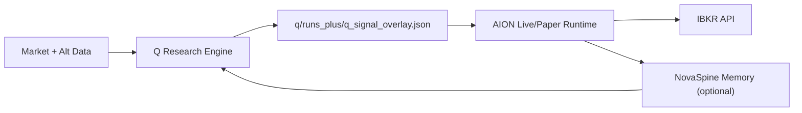
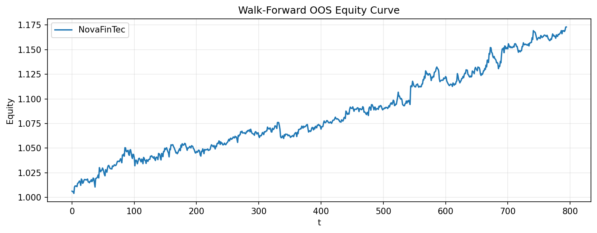

# NovaFinTec (AION + Q + NovaSpine)

NovaFinTec is a two-layer trading stack:

- `q/` is the research/portfolio brain (walk-forward, councils, governors, regime/risk assembly).
- `aion/` is the execution brain (IBKR paper runtime, live signaling, execution realism, ops/dashboard).
- `NovaSpine/` is the optional long-horizon memory layer used for event lineage and adaptive feedback.

## Architecture

Detailed diagrams: `docs/architecture.md`



## Quick Start

### 1) Run Q pipeline

```bash
cd q/
python tools/run_all_in_one_plus.py
python tools/build_final_portfolio.py
python tools/make_daily_from_weights.py
python tools/run_strict_oos_validation.py
python tools/run_cost_stress_validation.py
python tools/run_q_aion_integrated_backtest.py
python tools/publish_results_snapshot.py
```

### 2) Run AION paper engine

```bash
cd aion/
AION_MODE=brain AION_TASK=trade AION_TRADING_MODE=long_term ./run_aion.sh
```

Day-skimmer mode (minute bars):

```bash
cd aion/
AION_MODE=brain AION_TASK=trade AION_TRADING_MODE=day_skimmer ./run_aion.sh
```

Dashboard:

```bash
cd aion/
AION_MODE=brain AION_TASK=dashboard ./run_aion.sh
```

## Results Story

Published artifacts live under:

- `results/walkforward_metrics.json`
- `results/walkforward_equity.csv`
- `results/benchmarks_metrics.csv`
- `results/governor_compound_summary.json`

This gives a clear walk-forward equity/drawdown record plus SPY/QQQ benchmark context and governor-stack diagnostics.



Dream coherence refers to the causal alignment between spectral regime state and signal quality before allowing full exposure.

## Master Handoff

Canonical build handoff: `docs/NOVAFINTEC_MASTER_HANDOFF.md`

## Preset Profiles

Tiered profile presets are in `config/`:

- `config/default.yaml`
- `config/aggressive.yaml`
- `config/conservative.yaml`

Use:

- Q: `Q_PROFILE=aggressive python tools/run_all_in_one_plus.py`
- AION: `AION_PROFILE=conservative AION_MODE=brain AION_TASK=trade ./run_aion.sh`

Explicit env vars always override profile defaults.

## Safety

- Paper-trading first; promotion gates are mandatory for live progression.
- Cost stress + strict OOS checks should pass before increasing risk.
- This repository is research software, not investment advice.
