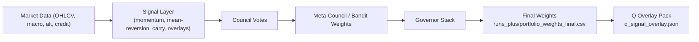
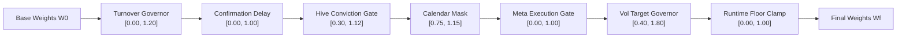
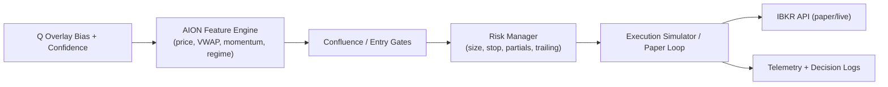
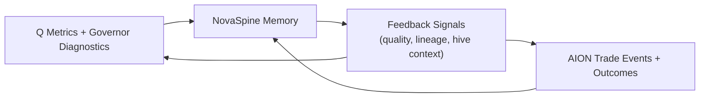

# NovaFinTec Architecture

This document captures the core production flow across Q (research), AION (execution), and NovaSpine (memory/feedback).

## Q Signal Flow

## Governor Stack (Multiplicative Chain)

Effective exposure is the product of enabled scalar governors applied element-wise or per-row against base weights.

## AION Execution Flow

## NovaSpine Feedback Loop

NovaSpine stores structured lineage and trade outcomes, then feeds summarized context back into both Q and AION to influence gating and confidence scaling.

